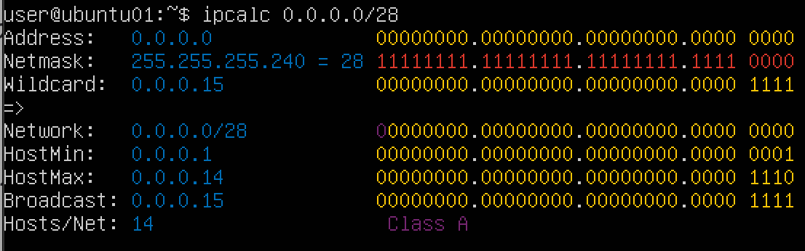
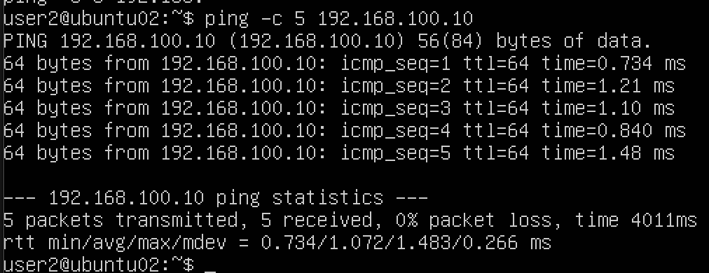
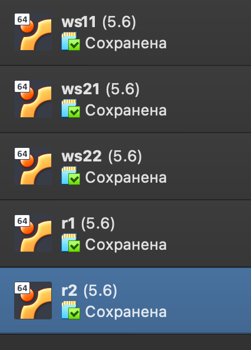
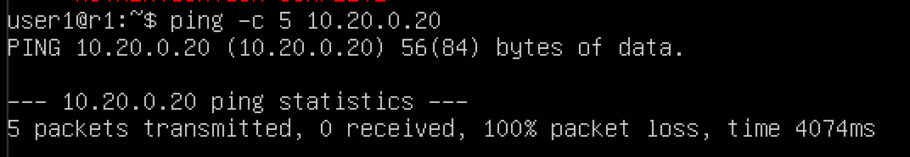

## Part 1. Инструмент **ipcalc**

### 1.1 Сети и маски

1.Адрес сети 192.167.38.54/13

2.Перевод маски 255.255.255.0 в префиксную и двоичную запись

/15 в обычную и двоичную

11111111.11111111.11111111.11110000 в обычную и префиксную

* Утилита ipcalc не принимает бинарные адреса напрямую. Вместо этого с помощью "Таблицы сетевых масок, префиксов маски. Короткая запись маски." получим данные о десятичной и префиксной частях.

3.Минимальный и максимальный хост в сети 12.167.38.4 при масках: /8, 11111111.11111111.00000000.00000000, 255.255.254.0 и /4

### 1.2. localhost

Определи и запиши в отчёт, можно ли обратиться к приложению, работающему на localhost, со следующими IP: 194.34.23.100, 127.0.0.2, 127.1.0.1, 128.0.0.1
* Диапазон localhost включает в себя адреса из класса A в диапазоне от 127.0.0.1 до 127.255.255.255

Можно обратиться:
127.0.0.2, 127.1.0.1

Нельзя обратиться:
194.34.23.100, 128.0.0.1

### 1.3. Диапазоны и сегменты сетей
1.В качестве публичных можно использовать:

    134.43.0.2
    172.0.2.1
    192.172.0.1
    172.68.0.2
    192.169.168.1
В качестве частных можно использовать:

    10.0.0.45
    192.168.4.2
    172.20.250.4
    172.16.255.255
    10.10.10.10

2.У сети 10.10.0.0/18 могут быть следующие IP-адреса:

    10.10.0.2
    10.10.10.10
    10.10.1.255   

## Part 2. Статическая маршрутизация между двумя машинами

С помощью команды `ip a` посмотрим существующие сетевые интерфейсы

 
На обеих машинах зададим следующие адреса и маски:
- ws1 - *192.168.100.10*, маска */16*
- ws2 - *172.24.116.8*, маска */12*

Выполним команду `netplan apply` для перезапуска сервиса сети.

### 2.1. Добавление статического маршрута вручную

В настройках машин во вкладке Адаптер 2 выберем внутренняя сеть с именем internet. Добавим статический маршрут от одной машины до другой и обратно при помощи команды вида ip r add. Пропингуем соединение между машинами.

### 2.2. Добавление статического маршрута с сохранением

Добавим статический маршрут от одной машины до другой с помощью файла /etc/netplan/00-installer-config.yaml.

Пропингуем соединение между машинами.

## Part 3. Утилита iperf3
### 3.1. Скорость соединения

* 8 Mbps = 1 MB/s
* 100 MB/s = 800000 Kbps
* 1 Gbps = 1000 Mbps

### 3.2. Утилита iperf3
Измерим скорость соединения между ws1 и ws2.

Выполняем команды на ws1 - iperf3 -s и на ws 2 - iperf3 -c 192.168.100.10, предварительно установив perf3

## Part 4. Сетевой экран
### 4.1. Утилита iptables
 * Создаем файл /etc/firewall.sh, имитирующий фаерволл, на ws1 и ws2 с помощью команды sudo touch /etc/firewall.sh
 * Добавляем в файл подряд следующие правила: 

1) На ws1 применим стратегию, когда в начале пишется запрещающее правило, а в конце пишется разрешающее правило (это касается пунктов 4 и 5).

2) На ws2 применим стратегию, когда в начале пишется разрешающее правило, а в конце пишется запрещающее правило (это касается пунктов 4 и 5).

3) Откроем на машинах доступ для порта 22 (ssh) и порта 80 (http).

4) Запретим echo reply (машина не должна «пинговаться», т.е. должна быть блокировка на OUTPUT).

5) Разрешим echo reply (машина должна «пинговаться»).

Запустим файлы на обеих машинах командами chmod +x /etc/firewall.sh и /etc/firewall.sh.

    Разница между стратегиями, применёнными в первом и втором файлах, заключается в следующем: в утилите iptables правила выполняются сверху вниз. На ws1 первым указано запрещающее правило на выход, поэтому она не сможет пропинговать другую машину. У ws2, наоброт - первым указано разрешающее правило, значит она сможет пропинговать другую машину.

### 4.2. Утилита nmap
Командой ping найдем машину, которая не «пингуется», после чего утилитой nmap покажем, что хост машины запущен:

    Проверка: в выводе nmap должно быть сказано: Host is up

Сохраним дампы: 

## Part 5. Статическая маршрутизация сети
Поднимаем пять виртуальных машин (3 рабочие станции (ws11, ws21, ws22) и 2 роутера (r1, r2)).

### 5.1. Настройка адресов машин
Настроим конфигурации машин в etc/netplan/00-installer-config.yaml согласно сети на рисунке.

Перезапустим сервис сети. Если ошибок нет, то командой ip -4 a проверим, что адрес машины задан верно.

Также пропингуем ws22 с ws21. Аналогично пропингуем r1 с ws11.

### 5.2. Включение переадресации IP-адресов

Для включения переадресации IP, выполним команду на роутерах:
`sysctl -w net.ipv4.ip_forward=1`

    При таком подходе переадресация не будет работать после перезагрузки системы.

Откроем файл /etc/sysctl.conf и добавим в него следующую строку:
net.ipv4.ip_forward = 1
    
    При использовании этого подхода, IP-переадресация включена на постоянной основе.

### 5.3. Установка маршрута по-умолчанию
Настроим маршрут по-умолчанию (шлюз) для рабочих станций. Для этого добавим default перед IP роутера в файле конфигураций.

Вызовем ip r и покажем, что добавился маршрут в таблицу маршрутизации.

Пропингуем с ws11 роутер r2 и покажем на r2, что пинг доходит.

### 5.4. Добавление статических маршрутов

 Добавим в роутеры r1 и r2 статические маршруты в файле конфигураций.
 
 

 Вызовем ip r и покажем таблицы с маршрутами на обоих роутерах.
  
  

 Запустим команды ip r list 10.10.0.0/[маска сети] и ip r list 0.0.0.0/0 на ws11:
 

  * для адреса 10.10.0.0/[маска сети] был выбран маршрут, отличный от 0.0.0.0/0 т.к маршрут по умолчанию 0.0.0.0/0 соответствует любому адресу, в то время как маршрут 10.10.0.0/18 указывает на конкретную подсеть с более точным определением адресов, что делает его более специфичным и предпочтительным для маршрутизации.

### 5.5. Построение списка маршрутизаторов

  Запустим на r1 команду дампа: 
   

  Вывод команды traceroute на ws11:
   

    Из дампа на r1, можно отследить что пакет проходит до адресса. Так работает утилита traceroute.

    Traceroute формирует UDP-датаграмму (сообщение, которое нужно доставить целевому серверу), упаковывает ее в IP-пакет и передаёт первому транзитному узлу. В заголовке такого IP-пакета есть поле TTL (Time To Live) — время жизни пакета. Оно определяет количество хопов, через которые пакет может пройти. На каждом узле TTL уменьшается на единицу. Если на пути к удаленному адресату время жизни пакета станет равно 0, маршрутизатор отбросит пакет и отправит источнику ICMP-сообщение об ошибке «Time Exceeded» (время истекло).

    Traceroute отправляет 3 UDP-пакета на определенный порт целевого хоста и ожидает ответа о недоступности этого порта. Первый пакет отправляется с TTL=1, второй с TTL=2 и так далее, пока запрос не попадет адресату. Так как он отправляет UDP-запрос, в каждом запросе есть порт отправителя (Sourсe) и порт получателя (Destination). По умолчанию запрос отправляется на закрытый порт 34434. Когда запрос попадёт на хост назначения, этот хост отправит ответ о недоступности порта «Destination port unreachable» (порт назначения недоступен). Это значит, что адресат получил запрос. Traceroute воспримет этот ответ как завершение трассировки.

### 5.6. Использование протокола ICMP при маршрутизации

Запустим на r1 перехват сетевого трафика:

Пропингуем с ws11 несуществующий IP:

Сохраним дампы:

## Part 6. Динамическая настройка IP с помощью DHCP

Для r2 настроим в файле /etc/dhcp/dhcpd.conf конфигурацию службы DHCP:
1) Укажем адрес маршрутизатора по-умолчанию, DNS-сервер и адрес внутренней сети. 

2) В файле resolv.conf пропишем nameserver 8.8.8.8.

Перезагрузим службу DHCP командой systemctl restart isc-dhcp-server.

Внесем изменения в /etc/netplan/00-installer-config.yaml на машинах ws21 и ws22:

Машину ws21 перезагрузим при помощи reboot и через ip a покажем, что она получила адрес. 

Также пропингуем ws22 с ws21.

Укажем MAC адрес у ws11, для этого в etc/netplan/00-installer-config.yaml надо добавить строки: macaddress: 10:10:10:10:10:BA, dhcp4: true.

Выключаем машину ws11 и в настройках меняем MAC-адрес

Для r1 настроим аналогично r2, но сделаем выдачу адресов с жесткой привязкой к MAC-адресу (ws11). Проведем аналогичные тесты.

`sudo nano /etc/dhcp/dhcpd.conf`

`sudo nano /etc/resolv.conf`

`systemctl restart isc-dhcp-server`

Запросим с ws11 обновление ip адреса.

Пропингуем соединение

Сначала запросим ip до обновления

Запросим с ws21 обновление ip адреса с доп информацией

Запросим ip после обвновления

Удалим старый ip

Проверим ip адрес

    sudo dhclient -v - эта команда запускает DHCP-клиент на интерфейсе (например, eth0) с подробным выводом (-v), пытаясь получить настройки с DHCP-сервера в сети. Если клиент успешно получает настройки, он настраивает соответствующий IP-адрес, маску подсети, шлюз и DNS-серверы для этого интерфейса.

    sudo dhclient -r - явно освобождает текущую аренду ip адреса.

Сохраним дампы

## Part 7. NAT

В файле /etc/apache2/ports.conf на ws22 и r1 изменим строку Listen 80 на Listen 0.0.0.0:80, то есть сделаем сервер Apache2 общедоступным.

Запустим веб-сервер Apache командой service apache2 start на ws22 и r1.

Добавим в фаервол, созданный по аналогии с фаерволом из Части 4, на r2 следующие правила:

1) Удаление правил в таблице filter - iptables -F;

2) Удаление правил в таблице "NAT" - iptables -F -t nat;

3) Отбрасывать все маршрутизируемые пакеты - iptables --policy FORWARD DROP.

Запустим файл и при запуске файла firewall.sh с этими правилами, ws22 не должна "пинговаться" с r1. 
Проверяем соединение между r1 и ws22

Добавим в файл ещё одно правило:
4) Разрешим маршрутизацию всех пакетов протокола ICMP.
Запустим файл

Проверим соединение между ws22 и r1 командой ping. При запуске файла с этими правилами, ws22 должна «пинговаться» с r1.

Добавим в файл ещё два правила:

5) Включим SNAT, а именно маскирование всех локальных ip из локальной сети, находящейся за r2 (по обозначениям из Части 5 - сеть 10.20.0.0).

6) Включим DNAT на 8080 порт машины r2 и добавим к веб-серверу Apache, запущенному на ws22, доступ извне сети.

Запустим файл также, как в Части 4.

Проверим соединение по TCP для SNAT: для этого с ws22 подключимся к серверу Apache на r1 :

Проверим соединение по TCP для DNAT: для этого с r1 подключимся к серверу Apache на ws22 командой telnet (обращаться по адресу r2 и порту 8080).

Сохраним дампы.

## Part 8. Дополнительно. Знакомство с SSH Tunnels

Запускаем виртуальные машины:

Запускаем веб-сервер Apache на ws22 только на localhost (то есть в файле /etc/apache2/ports.conf изменить строку Listen 80 на Listen localhost:80)

Внесем изменения в /etc/ssh/sshd_config на машинах ws11, ws21, ws22:
Раскомментировать Port 22
Раскомментировать ListenAddress 0.0.0.0
Раскомментировать ListenAddress ::

И перезапускаем sshd

Воспользуемся Local TCP forwarding с ws21 до ws22, чтобы получить доступ к веб-серверу на ws22 с ws21.
Создаём соединение. Запускаем на машине ws22 `ssh 10.20.0.20`

Запускаем на машине ws21 `ssh -L 8080:localhost:80 10.20.0.20`

Проверяем с помощью `telnet 127.0.0.1 80`

Воспользуемся Remote TCP forwarding c ws11 до ws22, чтобы получить доступ к веб-серверу на ws22 с ws11.

Внесем изменения в правила фаервола r2:

Переходим с машины ws11 на роутер r2 с помощью `ssh 10.100.0.12`

Переходим с роутера r2 на машину ws22 с помощью `ssh 10.20.0.20`

Пробрасываем тунель от ws22 к ws11 с помощью `ssh -R 10.10.0.2:8080:127.0.0.1:80 10.10.0.2`

Проверяем с помощью `telnet 127.0.0.1 80`
